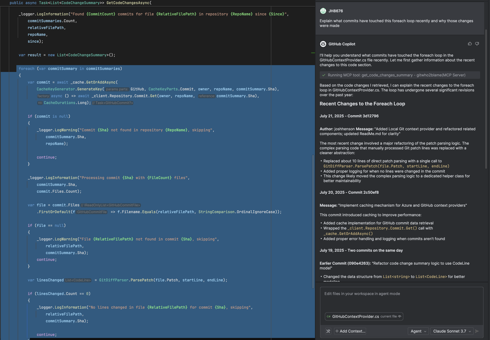
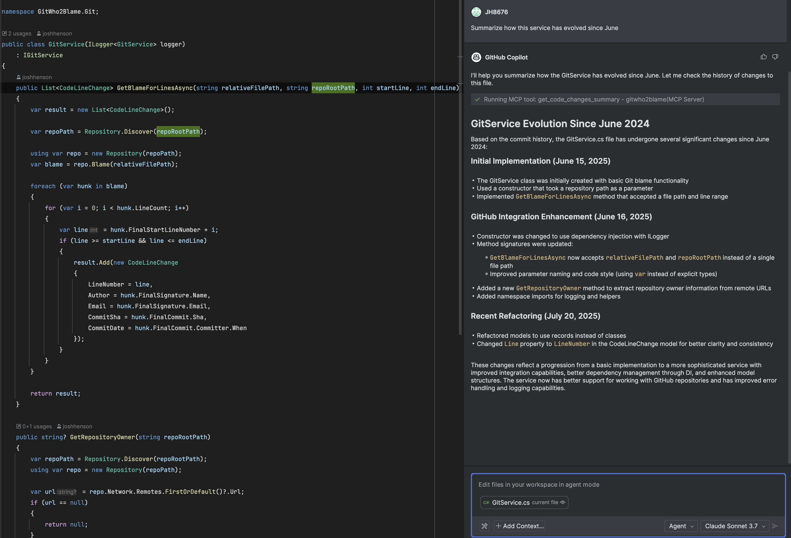

# GitWho2Blame

## Overview

## 🧠 GitWho2Blame – Understand Code Changes Instantly

Ever wondered *why* a piece of code was changed, or *who* made a subtle modification deep in a file? **GitWho2Blame** brings the power of large language models (LLMs) directly into your development workflow. Ask natural language questions about specific lines or changes, and get contextual, AI-powered answers — all without ever leaving your IDE.

Perfect for collaboration, onboarding, debugging, or just making sense of legacy code — GitWho2Blame connects to your favourite Git provider (Local Git, GitHub or Azure DevOps) and integrates seamlessly with your LSP-compatible IDE using [MCP](https://modelcontextprotocol.io/introduction).

## 🚀 Demo


## Examples 🔍

### 🕵️ Example 1: Investigating Code Changes

Wondering who updated that critical section of logic? Simply select the lines in question and ask:
```
Explain what commits have touched this foreach loop recently and why those changes were made
```



### 🔄 Example 2: Tracking Evolution of Features

Follow the development journey of specific features:
```
Summarize how this service has evolved since June
```



### 👥 Example 3: Team Collaboration 

Find out who to ask for more information:
```
Who has the most experience with this extension module?
```


## 💬 Feedback

I would love any feedback, ideas or a just prompts that worked well.

Just [start a discussion](https://github.com/JH8676/GitWho2Blame/discussions) or [open an issue](https://github.com/JH8676/GitWho2Blame/issues/new).

## 🔧 Setup & Usage

### Option 1: Run from Source (for development or debugging)

1. Clone this repository:
    ```bash
    git clone https://github.com/JH8676/GitWho2Blame.git
    ```
2. Add the following json to your `mcp.json`
    ```json
    {
      "servers": {
        "gitwho2blame": {
          "type": "stdio",
          "command": "dotnet",
          "args": [
            "run",
            "--project",
            "<path-to-cloned-repo>/GitWho2Blame/src/GitWho2Blame/GitWho2Blame.csproj",
            "--git-context-provider",
            "github"
          ],
          "env": {
            "TOKEN": "<your_pat_here> (only needed if using GitHub or Azure DevOps context providers)",
            "AZURE_GIT_PROJECT_ID": "<your_project_id_here> (only needed for Azure DevOps)",
            "AZURE_GIT_ORG_URI": "<your_organization_uri_here> (only needed for Azure DevOps)"
          }
        }
      }
    }
    ```

### Option 2: Run from Precompiled Binary (recommended for general use)

1. Download the latest release from https://github.com/JH8676/GitWho2Blame/releases
2. Extract the archive.
3. Update your `mcp.json`:
    ```json
    {
      "servers": {
        "gitwho2blame": {
          "type": "stdio",
          "command": "<path_to_extracted_binary>",
          "args": [
            "--git-context-provider",
            "github",
            "--transport-type",
            "stdio"
          ],
          "env": {
            "TOKEN": "<your_pat_here> (only needed if using GitHub or Azure DevOps context providers)",
            "AZURE_GIT_PROJECT_ID": "<your_project_id_here> (only needed if using Azure)",
            "AZURE_GIT_ORG_URI": "<your_organization_uri_here> (only needed if using Azure)"
          }
        }
      }
    }
    ```

## 🔗 Useful Links

- [MCP Protocol Introduction](https://modelcontextprotocol.io/introduction)
- [GitHub Copilot: Extending Copilot Chat with MCP](https://docs.github.com/en/copilot/how-tos/context/model-context-protocol/extending-copilot-chat-with-mcp)
- [JetBrains Rider: Configure an MCP Server](https://www.jetbrains.com/help/ai-assistant/configure-an-mcp-server.html)
- [VS Code: Use MCP servers in VS Code](https://code.visualstudio.com/docs/copilot/chat/mcp-servers)
- [GitWho2Blame Releases](https://github.com/JH8676/GitWho2Blame/releases)

## ⚙️ CLI Options

Option: `--git-context-provider`, alias: `-g`  
Description: The Git context provider to use.  
Default: `local`  
Valid values: `local`, `github`, `azure`

Option: `--transport-type`, alias: `-t`  
Description: The transport type to use.  
Default: `stdio`  
Valid values: `stdio`, `http`

## 🌐 Environment Variables

- `TOKEN`: Required for GitHub and Azure providers (Not Local). A GitHub or Azure DevOps personal access token (PAT). The token only requires read access for code and repositories.
- `AZURE_GIT_PROJECT_ID`: Required for Azure DevOps only.
- `AZURE_GIT_ORG_URI`: Required for Azure DevOps only.

## 🛠 Supported Git Context Providers

- `local` (default) – uses the local Git repository context
- `github` – requires only `TOKEN`
- `azure` – requires `TOKEN`, `AZURE_GIT_PROJECT_ID`, and `AZURE_GIT_ORG_URI`

## 🔌 Supported Transport Types

- `stdio` – For IDE integration or direct CLI interaction
- `http` – Useful for debugging or external tools communicating via HTTP (e.g., curl)

### Logging

GitWho2Blame logs runtime activity to help with debugging and monitoring usage.

🗂️ **Log File Location:**

- **Windows:**  
  `%LOCALAPPDATA%\gitwho2blame\gitwho2blame-.log`

- **macOS:**  
  `~/Library/Logs/gitwho2blame/gitwho2blame-.log`

- **Linux:**  
  `~/.local/share/gitwho2blame/gitwho2blame-.log`

The log includes internal operations, warnings, and error information. It does **not** transmit any data externally and is stored only on your machine.